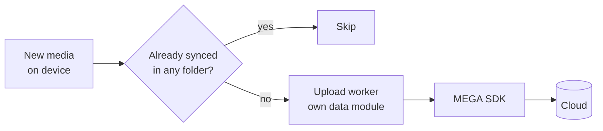

## Atiqur Rahman

Android engineer at **MEGA** — privacy-first cloud storage for 10M+ people. I make sync reliable
and cold starts fast.

Kotlin and Compose day to day, and a lot of time in the parts of Android that buckle under
real-world load: background work, file I/O, sync. I like problems where the fix is measurable —
most of mine turn out to be threading, caching, or deleting a layer that shouldn't have existed.

### What I build

**Sync & Backup** on MEGA Android — folder pickers, Cloud Explorer integration, Sync Dashboard,
Device Center. Two-way sync is unforgiving: most of the work is conflict handling and keeping
state you can actually trust.

**Camera Uploads** — re-architected off a legacy engine onto Clean Architecture and Coroutines,
upload worker extracted into its own data module, cross-folder conflict detection added.

Camera Uploads after the re-architecture — simplified.

**A Compose PDF viewer**, from scratch, with an in-document search engine on PdfiumCore — which
meant first contributing native text extraction and search (JNI) upstream to PdfiumAndroid.

### Things I made faster

- **Upload crashes −35%** — the Camera Uploads re-architecture above
- **Directory listing +40%** — fewer Storage Access Framework IPC round trips, cached single-child lookups
- **ANR rate −30%** — fixed Camera Uploads preference reads and `Sync` repository threading, made eager sync flows lazy
- **Cold start −20%** — pre-loaded the MEGA SDK native library off the main thread, kept credential and preferences gateways out of the startup path

### Working with

- **Daily** — Kotlin · Jetpack Compose · Coroutines/Flow · Hilt · WorkManager · Room · Retrofit · Material 3
- **Shape of the code** — Clean Architecture · multi-module · dependency injection
- **Tests** — JUnit · Turbine · Robolectric · Espresso
- **Also** — Kotlin Multiplatform · Flutter · Java · Dart

<b>How I usually find an Android performance bug</b>

 

Nearly every one I've fixed turned out to be one of four things:

1. **Wrong thread** — something blocking on the main thread that had no business being there. Native library loads and preference reads are the usual suspects.
2. **Per-item IPC** — an abstraction that looks like a list but crosses a process boundary once per element. Storage Access Framework is famous for this.
3. **Eager work** — initialised at startup because it was easier than working out when it's actually needed.
4. **No cache** — the same answer computed repeatedly because nobody measured how often it was asked for.

None of that shows up in code review. It shows up in Play Console vitals and a systrace, which is why I go there first and form an opinion second.

**Now** — going deeper on Kotlin Multiplatform, and letting AI tooling take the boring half of the
work. Before MEGA I spent six years leading mobile teams at Monstarlab, shipping client apps end
to end.

---

[Email](mailto:atiq.it@gmail.com) · [LinkedIn](https://www.linkedin.com/in/atiqur-rahman-ab267379)
